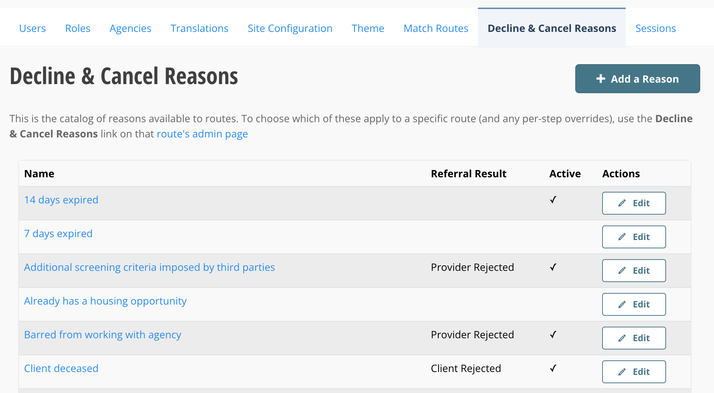
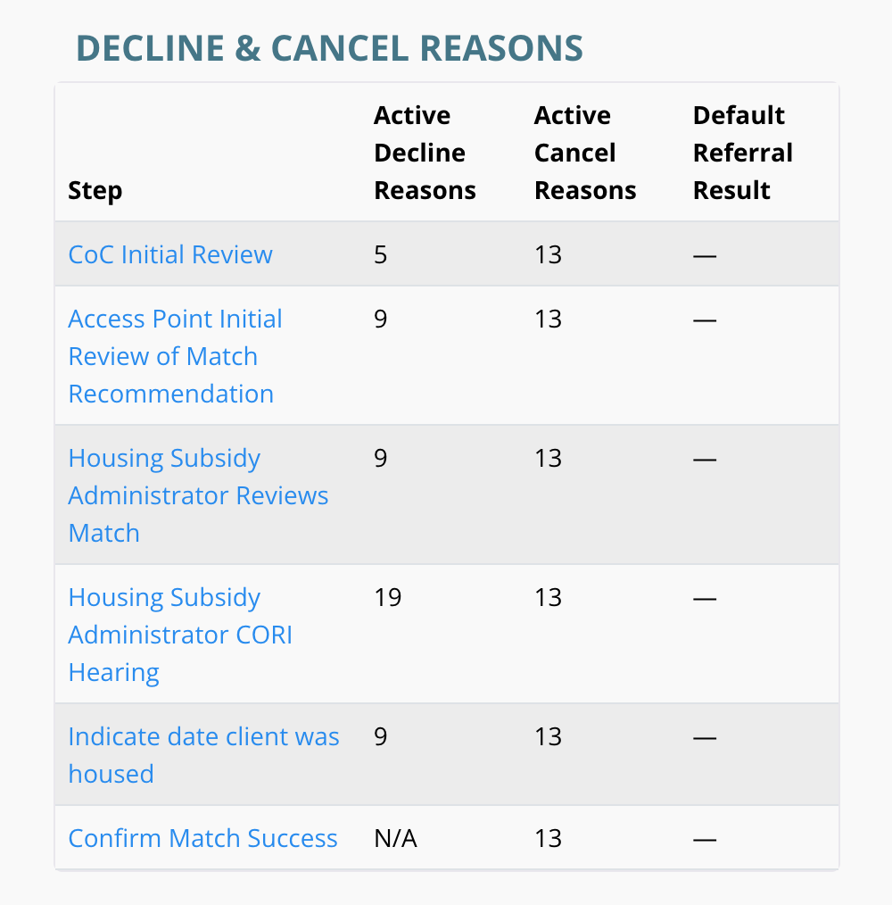
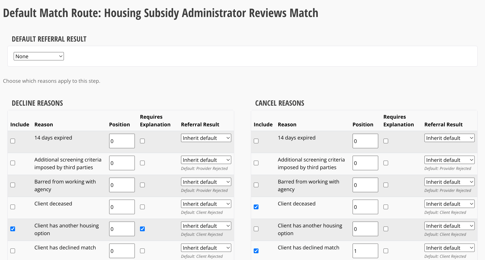
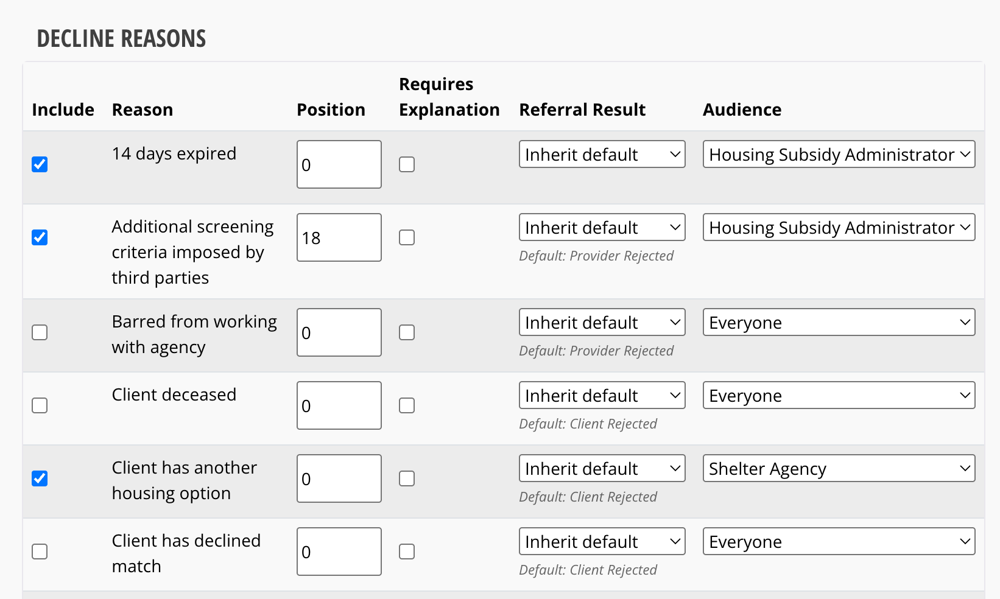
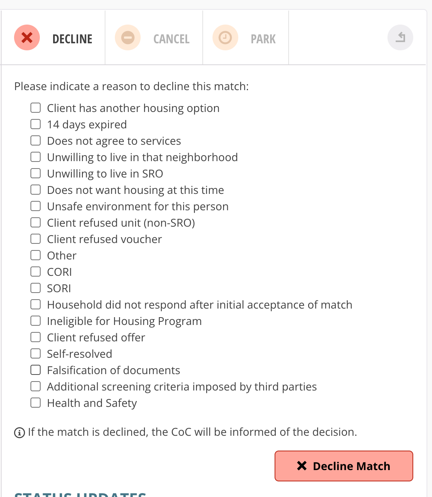

# Managing Decline & Cancel Reasons

## Contents

1. [The Reason Catalog](#the-reason-catalog)
2. [Finding a Route's Steps](#finding-a-routes-steps)
3. [Choosing Reasons for a Step](#choosing-reasons-for-a-step)
4. [Restricting a Reason to a Specific Audience](#restricting-a-reason-to-a-specific-audience)
5. [Verify Your Changes](#verify-your-changes)

---

## The Reason Catalog

Go to **Decline & Cancel Reasons** in the admin navigation bar (`/admin/match_decision_reasons`). This page lists every reason that can be offered to someone declining or canceling a match, across every route.

Each row shows:

- **Name** — the wording shown to the person declining or canceling a match.
- **Referral Result** — whether choosing this reason counts as the client being rejected or the provider being rejected, for CE APR reporting. Leave this blank if it's neither.
- **Active** — a checkmark means the reason is currently available to be assigned to routes and steps. No checkmark means it's turned off.

To add a new reason, click **Add a Reason** in the top right. To change a reason's wording, its referral result, or turn it on/off, click **Edit** on that row.

> **Note:** Renaming a reason here only changes what's offered going forward. It does **not** rewrite the wording on matches that were already declined or canceled using the old name — that history is preserved exactly as it was recorded at the time.

This catalog only controls what reasons *exist*. It doesn't decide which reasons show up on which route or step — that's covered next.

---

## Finding a Route's Steps

Go to **Match Routes** in the admin nav (`/admin/match_routes`), then click **Edit** on the route you want to configure.

Scroll to the **Decline & Cancel Reasons** section on that route's edit page. It lists every step on the route, with a count of how many active decline and cancel reasons are currently assigned to each one.

A few things to note about this table:

- **Active Decline Reasons** shows **N/A** for a step that doesn't have a decline option at all (like "Confirm Match Success" above) — there's nothing to configure there.
- A count of **0** means the step currently has no reasons assigned — no one will see any checkboxes to decline or cancel with until you assign some.
- **Default Referral Result** shows the fallback CE APR referral result for this step, used only when neither the reason itself nor a specific assignment sets one. Most steps leave this blank (shown as —).

Click a step's name to manage its reasons.

---

## Choosing Reasons for a Step

A step's edit page has two independent tables: **Decline Reasons** and **Cancel Reasons**. (If a step doesn't support declines at all, only the Cancel Reasons table appears.)

For each reason in the catalog, you can set:

- **Include** — check this box to make the reason available on this step. Unchecked reasons simply won't show up as an option.
- **Position** — controls the display order. Lower numbers appear first.
- **Requires Explanation** — check this if choosing this reason should also require the person to type a free-text explanation. **"Other" always requires an explanation, no matter what this checkbox says.**
- **Referral Result** — overrides whether choosing this reason counts as Client Rejected or Provider Rejected, for this step only. Most reasons show their catalog-wide default underneath the dropdown (e.g. *Default: Provider Rejected*); leave it set to **Inherit default** unless this step needs to record it differently.

Decline and Cancel are configured completely separately — a reason can be included for one and not the other, with its own position, explanation flag, and referral result for each.

When you're done, click **Save Step Reasons** at the bottom of the page.

---

## Restricting a Reason to a Specific Audience

Most steps only have one type of contact who can act on them, so every reason is simply visible to whoever reaches that step. One step is different: **Housing Subsidy Administrator CORI Hearing** can be declined independently by either a **Shelter Agency** contact or a **Housing Subsidy Administrator** contact — and each should see reasons relevant to what *they* would know, not the other's.

For that step (and only that step), the Decline Reasons table has an extra **Audience** column:

- **Everyone** (the default) — the reason is offered to whoever is declining, regardless of which contact type they are.
- **Shelter Agency** — only a Shelter Agency contact sees this reason.
- **Housing Subsidy Administrator** — only a Housing Subsidy Administrator contact sees this reason.

A contact who can act on behalf of others (an admin override) always sees every reason, no matter what audience is set.

You won't see this column on any other step — it only appears where more than one contact type can independently decline the match.

---

## Verify Your Changes

After saving reason assignments, it's worth opening an in-progress match at that step to confirm the reasons you configured actually show up.

Open the match, go to that step's card, and switch to the **Decline** (or **Cancel**) tab. You should see exactly the reasons you checked off, in the order you set, with "Other" and any explanation-required reasons behaving as expected.

An admin account (one that can act on behalf of match contacts) always sees every reason regardless of audience, so this view is a good way to confirm everything is *included* correctly — but it won't show you what a specific Shelter Agency or Housing Subsidy Administrator contact sees when audience restrictions are in play. To check that, you'd need to view the match as a contact of that specific type.
